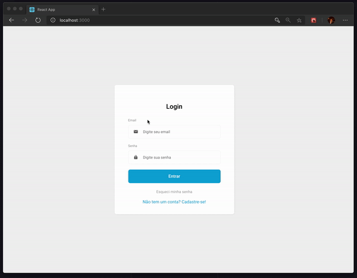

# Nome do produto

📜 Descrição curta sobre o que seu projeto faz.

[![NPM Version][npm-image]][npm-url]
[![Build Status][travis-image]][travis-url]
[![Downloads Stats][npm-downloads]][npm-url]

💡 No dashboard do funcionário é possível fazer a listagem e criação de agendamentos.

Na listagem é possível filtrar por datas. Os dias tem variações de cores de acordo
com o número de agendamentos do dia.

Podendo ser, cinza (não tem agendamento), laranja claro (tem um ou mais agendamentos),laranja escuro (não tem horário dispoível).

É possível atualizar informações do perfil do usuário.

Na versão para o cliente, é possível a criação do agendamento, listagem dos agendamentos e atualização do perfil.



```

## 🗃 Histórico de lançamentos

    * CONSERTADO: Crash quando chama `baz()` (Obrigado @NomeDoContribuidorGeneroso!)
* 0.1.0
    * O primeiro lançamento adequado
    * MUDANÇA: Renomeia `foo()` para `bar()`
* 0.0.1
    * Trabalho em andamento


[npm-image]: https://img.shields.io/npm/v/datadog-metrics.svg?style=flat-square
[npm-url]: https://npmjs.org/package/datadog-metrics
[npm-downloads]: https://img.shields.io/npm/dm/datadog-metrics.svg?style=flat-square
[travis-image]: https://img.shields.io/travis/dbader/node-datadog-metrics/master.svg?style=flat-square
[travis-url]: https://travis-ci.org/dbader/node-datadog-metrics
[wiki]: https://github.com/seunome/seuprojeto/wiki
```
